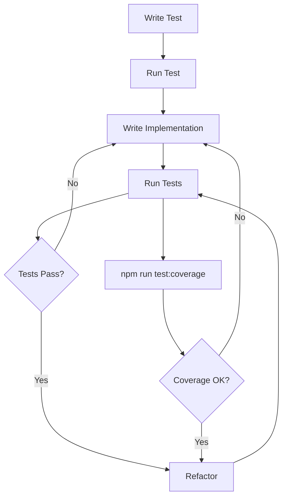
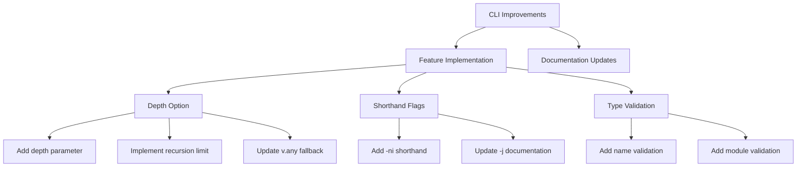

# Active Context

## Current Focus
All tests are passing successfully. Current focus remains on CLI improvements and parser enhancements, with test coverage maintained. Implementation status of JSON Schema features is now tracked in json-schema-support.md.

## Implementation Plan

### Test-Driven Development Approach

### CLI and Parser Improvements

### Implementation Details

1. **Depth Option**
   - Added depth parameter to CLI options
   - Implemented recursion depth tracking in schema parsing
   - Added fallback to v.any() when depth limit reached
   - Updated parser functions to handle depth

2. **CLI Improvements**
   - Added -ni shorthand for --noImport
   - Fixed -j shorthand documentation for --withJsdocs
   - Added validation for --type option requirements

3. **Parser Updates**
   - Modified parseSchema to track recursion depth
   - Updated parseObject, parseArray, and parseAnyOf to handle depth
   - Improved type validation in schema generation

4. **JSON Schema Support**
   - Migrated feature tracking to memory-bank/json-schema-support.md
   - Basic data types fully implemented
   - Most string formats supported
   - Core validation features in place
   - Some advanced features pending implementation

## Next Steps
1. Add tests for depth limitation functionality
2. Update documentation with new CLI options
3. Add examples for depth-limited schema conversion
4. Implement error handling for invalid depth values
5. Continue implementing pending JSON Schema features (see json-schema-support.md)

## Recent Changes
- Implemented depth option for recursive schema parsing
- Fixed CLI shorthand flags and documentation
- Added type option validation
- Updated parser functions to support depth tracking
- Migrated JSON Schema support tracking to memory bank

## Active Decisions
- Using v.any() as fallback for deep schemas
- Maintaining backward compatibility with existing options
- Improving CLI usability with better shorthand flags
- Tracking implementation status in memory bank for better visibility