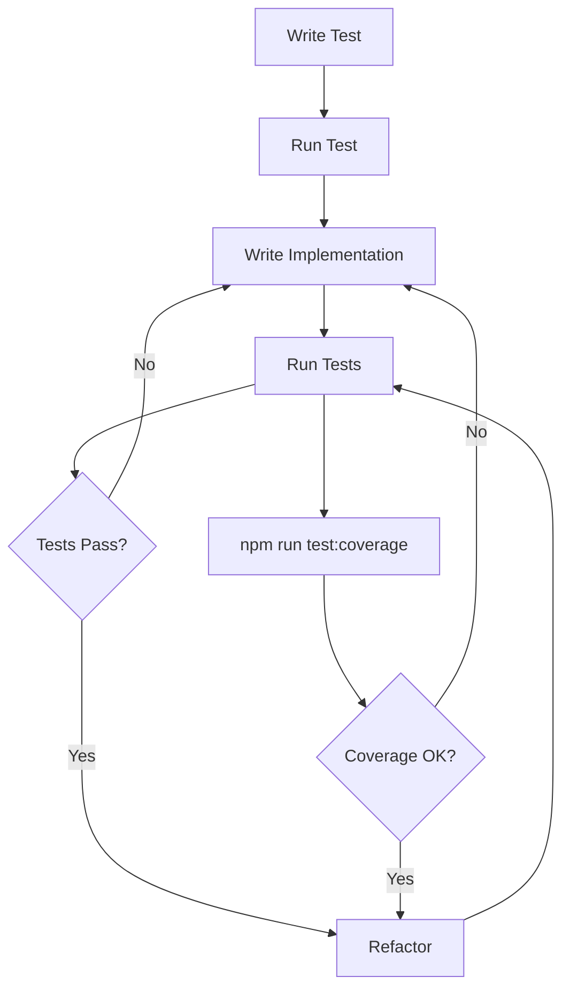
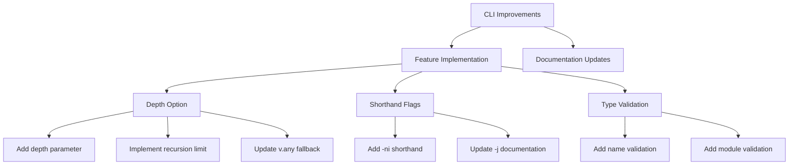

# Active Context

## Current Focus
Successfully completed depth option implementation and fixed all test failures. All tests are now passing with the new functionality. Implementation status of JSON Schema features continues to be tracked in json-schema-support.md.

## Implementation Plan

### Test-Driven Development Approach

### CLI and Parser Improvements

### Implementation Details

1. **Depth Option** ✓
   - Added depth parameter to CLI options
   - Implemented recursion depth tracking in schema parsing
   - Added fallback to v.any() when depth limit reached
   - Updated parser functions to handle depth
   - Added tests for depth functionality
   - Fixed all test failures and updated snapshots

2. **CLI Improvements**
   - Added -ni shorthand for --noImport
   - Fixed -j shorthand documentation for --withJsdocs
   - Added validation for --type option requirements

3. **Parser Updates**
   - Modified parseSchema to track recursion depth
   - Updated parseObject, parseArray, and parseAnyOf to handle depth
   - Improved type validation in schema generation

4. **JSON Schema Support**
   - Migrated feature tracking to memory-bank/json-schema-support.md
   - Basic data types fully implemented
   - Most string formats supported
   - Core validation features in place
   - Some advanced features pending implementation

## Next Steps
1. Add more test cases for edge cases in depth handling
2. Implement error handling for invalid depth values
3. Continue implementing pending JSON Schema features (see json-schema-support.md)
4. Consider performance optimizations for large schemas
5. Expand documentation with depth option examples

## Recent Changes
- Completed depth option implementation with all tests passing
- Fixed CLI shorthand flags and documentation
- Added type option validation
- Updated parser functions to support depth tracking
- Added and fixed tests for depth functionality
- Fixed README.md to reflect accurate CLI options
- Updated help text in CLI to include depth option
- Fixed test snapshots to match new behavior

## Active Decisions
- Using v.any() as fallback for deep schemas
- Maintaining backward compatibility with existing options
- Improving CLI usability with better shorthand flags
- Tracking implementation status in memory bank for better visibility
- Planning to add more test cases for complex nested schemas
- Considering performance optimizations for large schemas
