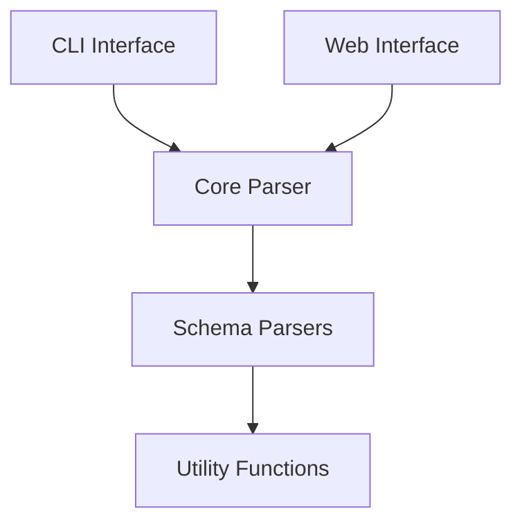

# System Patterns

## Architecture Overview

## Project Structure
- Monorepo Architecture
  - packages/json-schema-to-valibot (Core Package)
  - packages/website (Web Interface)

## Core Package Patterns
### Parser Architecture
- Modular parser design
- Recursive depth tracking system:
  - Depth parameter propagation through parser chain
  - Fallback to v.any() at depth limit
  - Depth counter in parseSchema
  - Depth handling in parseObject and parseArray
  - Depth parameter passing in recursive calls
  - Implementation details:
    - CLI depth option for controlling recursion
    - Depth check in recursive parsers only
    - Graceful fallback to v.any() for deep structures
    - Maintains schema validation at specified depth
- Individual parsers for different schema types:
  - Array schemas
  - Object schemas
  - String schemas
  - Number schemas
  - Boolean schemas
  - Enum schemas
  - AnyOf schemas

### CLI Architecture
- Command-line interface patterns:
  - Consistent shorthand flags (-ni, -j)
  - Option validation (type requirements)
  - Default value handling
  - Depth limitation support

### Testing Strategy
- Unit tests for each parser
- Snapshot testing for CLI output
- Fixture-based testing for complex schemas
- Test patterns for depth handling:
  - Simple nested object tests
  - Array depth tests
  - Complex schema integration tests
  - CLI option validation tests
  - Help text snapshot tests

### Utility Functions
- Schema enhancement utilities
  - Default value handling
  - Description preservation
  - String escaping

## Website Patterns
### Component Architecture
- Next.js framework
- React components hierarchy
- UI component library integration
- Custom hooks for functionality

### State Management
- Local component state
- Custom hooks for shared logic
- Toast notifications for user feedback

## Common Patterns
### Code Organization
- Clear module boundaries
- Separation of concerns
- Type-driven development
- Comprehensive testing

### Error Handling
- Structured error types
- Descriptive error messages
- Graceful fallbacks
- Depth-related error handling:
  - Invalid depth parameter validation
  - Clear error messages for depth limits
  - Graceful fallback to v.any() for deep structures
  - Maintains schema integrity at specified depth

### Development Practices
- Test-Driven Development (TDD):
  - Write failing tests first
  - Implement minimum code to pass
  - Refactor while maintaining tests
  - Test coverage for all features
  - Focus areas:
    - Edge case testing
    - Performance optimization
    - Documentation improvements
    - Error handling enhancements
- TypeScript for type safety
- Biome for code formatting
- Monorepo package management
